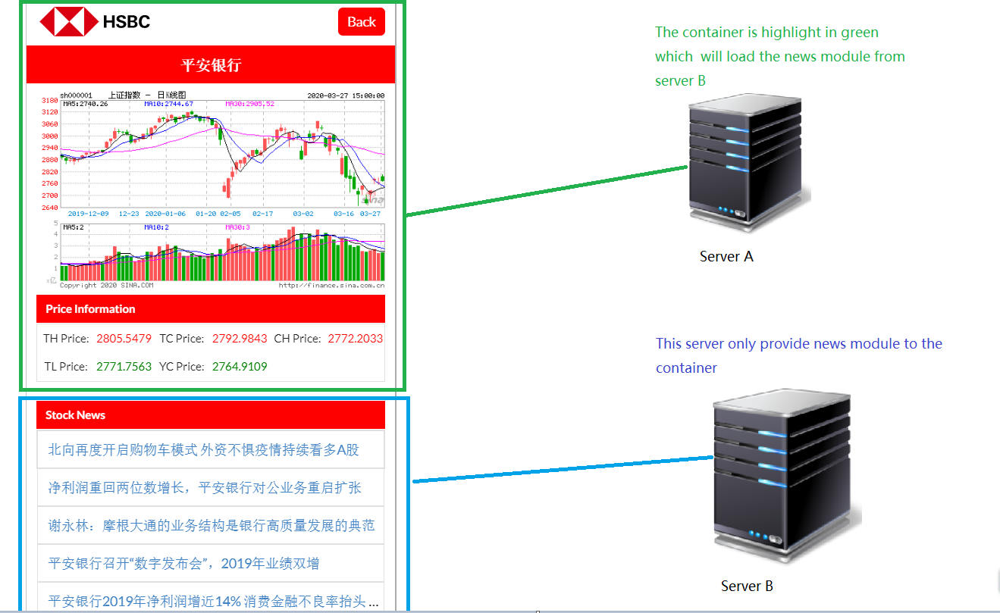

# HSBC STOCK APP

This is a stock app provide customer to search stock and get stock related inforamtion.

# Technical Stack

  - Reactjs is used as front end framework
  - Nodejs is used as backend service
  - Puppeteer is used as spider tool
  - PM2 is used as process managerment tool

# Inovivation Point

  - Front end micro service
  - Spider API for stock information

Front End Micro Service:
>We always feel painful when there are many guys work on same project and wait for master branch to release our change to production. It will be nightmare for a huge project which bind all logic into one component. For backend, we work out a concept "micro service" to solve above problems.This give me tips that why I cannot do this in front end development

>In the stock app project I separate this app into only two parts for demo purpose. In the stock app, it has a container which is used for loading other module from other server. The news module had been package as UMD module and will be imported by stock container via http request.



Below Is The Key Code To Load News Module In Container

```javascript
  componentDidMount() {
        // Load Component From Other Server
        axios.get(`${NEWUI_BASE_URL}/asset-manifest.json`, { headers: {'Cash-Control': 'no-cache'} } )
        .then(resp => {
            // Load Js and Css according to asset-manifest.json File
            const jsFile = resp.data.files['main.js'];
            const cssFile = resp.data.files['main.css'];
            this.loadCSS(cssFile);
            if(resp.data['vendors~main.js']) {
                this.loadJS(jsFile);
            }
            this.loadJS(jsFile);
        })

        this.getStockInfo(this.props.match.params.stockid);
    }

    loadCSS = (cssFile) => {
        let linkTag = document.createElement('link');
        linkTag.rel = 'stylesheet';
        linkTag.type = 'text/css';
        linkTag.href = `${NEWUI_BASE_URL}/${cssFile}`;
        document.head.appendChild(linkTag);
    }

    loadJS = (jsFile) => {
        let scriptTag = document.createElement('script');
        scriptTag.src = `${NEWUI_BASE_URL}${jsFile}`;

        scriptTag.onload = () => {
            console.log('scriptTag.onload');
            this.setState({ Newsui: window.newsui.default });
        };
        scriptTag.onreadystatechange = () => {
            console.log('scriptTag.onreadystatechange');
        };
        document.body.appendChild(scriptTag);
    }
```

Spider API For Stock Information:

>The data is great fortune for all companys and individuals. The stock data need paid and the free API cannot meet our requirement. In this situation, spider data from other website is the cheapest way to get stock information. Spiding data give us the more flexibility to get data we want. This is http://stock.hexun.com/ the source data website.


The problem how to covert the data format from source website into JSON format suffer me for long time. Below is a samlpe original data (This data is a pain text)

```javascript
  GetNews([{codeshow:'000004', icbname:'医药与生物科技', industrymore:'http://ggzx.stock.hexun.com/more.jsp?t=2&s=0&k=4570', corpnews:['<li><span>01-22</span><a href="http://stock.hexun.com/2020-01-22/200068908.html" target="_blank" title="华峰氨纶2019年度预计盈利15亿以上较上年同期增长236.91%-304.29%">华峰氨纶2019年度预计盈利15亿以上较上..</a></li>',
'<li><span>01-20</span><a href="http://stock.hexun.com/2020-01-20/200041474.html" target="_blank" title="中洲控股2019年预计净利6.86亿元–8.87亿元同比增长53.56%-98.56%">中洲控股2019年预计净利6.86亿元–8.87..</a></li>',
'<li><span>01-18</span><a href="http://stock.hexun.com/2020-01-18/200011825.html" target="_blank" title="国农科技2019年度预计净利250万元—500万元同比增长112%—125%">国农科技2019年度预计净利250万元—500..</a></li>',
'<li><span>01-16</span><a href="http://stock.hexun.com/2020-01-16/199999635.html" target="_blank" title="上市药企销售费用为何两年激增超千亿？院长落马牵出黑色产业链">上市药企销售费用为何两年激增超千亿？..</a></li>',
'<li><span>01-16</span><a href="http://stock.hexun.com/2020-01-16/199993101.html" target="_blank" title="瑞泰科技下属公司收到福利企业增值税退税329万元">瑞泰科技下属公司收到福利企业增值税退..</a></li>',
'<li><span>01-10</span><a href="http://stock.hexun.com/2020-01-10/199927971.html" target="_blank" title="复星医药(02196)：治黑色素瘤新药HLX13获药品临床试验申请受理">复星医药(02196)：治黑色素瘤新药HLX13..</a></li>',
'<li><span>01-03</span><a href="http://stock.hexun.com/2020-01-03/199864529.html" target="_blank" title="科信技术(300565.SZ)第一大股东张锋峰解除质押1股">科信技术(300565.SZ)第一大股东张锋峰..</a></li>',
'<li><span>12-27</span><a href="http://stock.hexun.com/2019-12-27/199813403.html" target="_blank" title="中国国航董事曹建雄辞职因到年龄原因">中国国航董事曹建雄辞职因到年龄原因</a></li>'],industrynews:['<li><span>02-15</span><a href="http://shandong.hexun.com/2020-02-15/200301017.html" target="_blank">证监会：A股经受住了疫情考验 部分融..</a></li>',
'<li><span>02-15</span><a href="http://stock.hexun.com/2020-02-15/200300906.html" target="_blank">证监会副主席阎庆民：鼓励社保等中长..</a></li>',
'<li><span>02-15</span><a href="http://bank.hexun.com/2020-02-15/200299996.html" target="_blank">商业银行加大信贷投放抗疫  千亿资金..</a></li>',
'<li><span>02-15</span><a href="http://stock.hexun.com/2020-02-15/200299753.html" target="_blank">证监会五方面举措积极应对疫情 A股经..</a></li>',
'<li><span>02-15</span><a href="http://stock.hexun.com/2020-02-15/200299758.html" target="_blank">证监会：A股经受住严峻考验 基本回归..</a></li>',
'<li><span>02-15</span><a href="http://stock.hexun.com/2020-02-15/200299586.html" target="_blank">证监会：引导更多的社会资金流向生产..</a></li>',
'<li><span>02-15</span><a href="http://news.hexun.com/2020-02-15/200299674.html" target="_blank">抢占科技股赛道先机 中邮科技创新基..</a></li>',
'<li><span>02-15</span><a href="http://stock.hexun.com/2020-02-15/200299198.html" target="_blank">年报进入披露期 医药、家用电器、建..</a></li>'],report:['<li><span>10-31</span><a href="http://stockdata.stock.hexun.com/txt/stock_detail_1207047701.shtml" target="_blank">国农科技：2019年第三季度报告正文</a></li></li>',
'<li><span>10-31</span><a href="http://stockdata.stock.hexun.com/txt/stock_detail_1207047702.shtml" target="_blank">国农科技：2019年第三季度报告全文</a></li></li>',
'<li><span>08-31</span><a href="http://stockdata.stock.hexun.com/txt/stock_detail_1206867964.shtml" target="_blank">国农科技：2019年半年度报告摘要</a></li></li>',
'<li><span>08-31</span><a href="http://stockdata.stock.hexun.com/txt/stock_detail_1206867965.shtml" target="_blank">国农科技：2019年半年度报告</a></li></li>',
'<li><span>04-26</span><a href="http://stockdata.stock.hexun.com/txt/stock_detail_1206104267.shtml" target="_blank">国农科技：2018年年度报告摘要</a></li></li>',
'<li><span>04-26</span><a href="http://stockdata.stock.hexun.com/txt/stock_detail_1206104282.shtml" target="_blank">国农科技：2019年第一季度报告正文</a></li></li>',
'<li><span>04-26</span><a href="http://stockdata.stock.hexun.com/txt/stock_detail_1206104283.shtml" target="_blank">国农科技：2019年第一季度报告全文</a></li></li>',
'<li><span>04-26</span><a href="http://stockdata.stock.hexun.com/txt/stock_detail_1206104284.shtml" target="_blank">国农科技：2018年年度报告</a></li></li>'],ggzy:['<li><span>01-21</span><a href="http://stockdata.stock.hexun.com/txt/stock_detail_txt_1207270758.shtml" target="_blank" title="国农科技(000004):简式权益变动报告书（一）">国农科技：简式权益变动报告书（一）</a></li>',
'<li><span>01-21</span><a href="http://stockdata.stock.hexun.com/txt/stock_detail_txt_1207270759.shtml" target="_blank" title="国农科技(000004):简式权益变动报告书（二）">国农科技：简式权益变动报告书（二）</a></li>',
'<li><span>01-18</span><a href="http://stockdata.stock.hexun.com/txt/stock_detail_txt_1207262463.shtml" target="_blank" title="国农科技(000004):中天国富证券有限公司关于公司发行股份购买资产暨关联交易实施情况之独立财务顾问核查意见">国农科技：中天国富证券有限公司关于公..</a></li>',
'<li><span>01-18</span><a href="http://stockdata.stock.hexun.com/txt/stock_detail_txt_1207262464.shtml" target="_blank" title="国农科技(000004):安徽天禾律师事务所关于公司发行股份购买资产暨关联交易之实施情况的法律意见书">国农科技：安徽天禾律师事务所关于公司..</a></li>',
'<li><span>01-18</span><a href="http://stockdata.stock.hexun.com/txt/stock_detail_txt_1207262465.shtml" target="_blank" title="国农科技(000004):验资报告">国农科技：验资报告</a></li>',
'<li><span>01-18</span><a href="http://stockdata.stock.hexun.com/txt/stock_detail_txt_1207262466.shtml" target="_blank" title="国农科技(000004):关于发行股份购买资产相关方承诺事项的公告">国农科技：关于发行股份购买资产相关方..</a></li>',
'<li><span>01-18</span><a href="http://stockdata.stock.hexun.com/txt/stock_detail_txt_1207262467.shtml" target="_blank" title="国农科技(000004):关于公司董事、监事和高级管理人员持股变动情况的公告">国农科技：关于公司董事、监事和高级管..</a></li>',
'<li><span>01-18</span><a href="http://stockdata.stock.hexun.com/txt/stock_detail_txt_1207262468.shtml" target="_blank" title="国农科技(000004):发行股份购买资产暨关联交易实施情况暨新增股份上市公告书">国农科技：发行股份购买资产暨关联交易..</a></li>']}])
```

# What We Can Do Better

For Front End Part:
  - How to develop a separated module in a more convenience way (Without launch container)
  - How to extract the common part of js file from different module into one to save js file traffic
  - How to manager the custom CSS and shared CSS with different component

For Back End Part:
  - How to manage and setup mutiple process or instance to run spider to make it more effective
  - How to build up a high performance cash for spider data (How to manage what data should be cache in memory and what should cache in DB)
